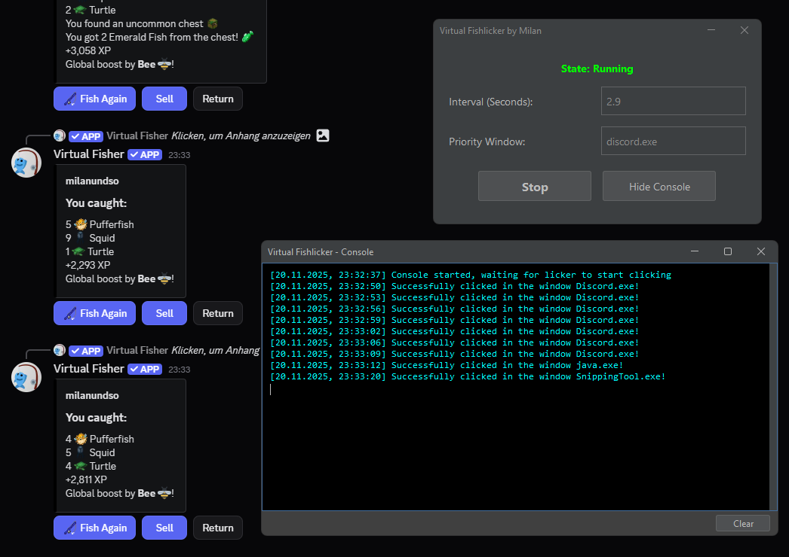

<div align="left">

# VirtualFishlicker

### AutoClicker designed for the Virtual Fisher on discord :-)

[](https://www.oracle.com/java/)
[](https://gradle.org/)
[](LICENSE)


## Quick Start

```bash
# build the project
./gradlew build

# run directly
./gradlew run

# create executable jar
./gradlew jar
java -jar build/libs/VirtualFishlicker-1.0-SNAPSHOT.jar
```

## Usage

1. Set Interval → Enter the cooldown you have for the bot (for example `3.5`)
2. Priority Window → Specify on which window it should click (I reccomend `discord.exe`)
3. Click Start

### Example



## Tech Stack

| Component | Technology |
|-----------|-----------|
| Language | Java 24 |
| Build Tool | Gradle (Kotlin DSL) |
| UI Framework | Swing + FlatLaf Dark |
| Native Access | JNA (Java Native Access) |
| Event Handling | JNativeHook |


## Requirements

- Windows (for window detection)
- JDK 21 or higher
- May require admin rights for certain applications

---
